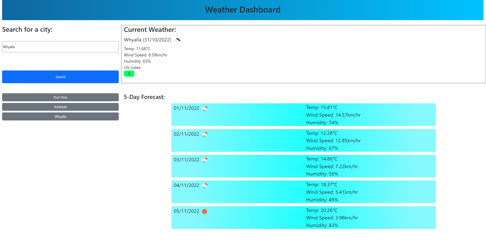

# Weather-Dashboard

## Description

 This website application is used to display the current weather and the forecasted weather for the next 5 days for any city which the user inputs.

 The weather dashboard displays stats such as temperature, wind speed, uv index, humidity level and the weather icon relevent to the day. It also stores previous searches in the history tab, which can be selected and searched for again.

## Usage

Deployed application:  
https://biscuit231.github.io/Weather-Dashboard/

## Credits

Bootstrap:
https://getbootstrap.com/

Moment.js:
https://momentjs.com/

My Github:  
https://github.com/biscuit231/

Readme guide:  
https://coding-boot-camp.github.io/full-stack/github/professional-readme-guide

## License

MIT License